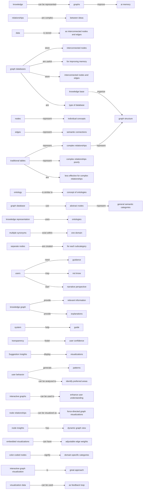

# Knowledge graph (auto-built by Carlos)

```mermaid
graph LR
  n25["graphs"] -->|improve| n3["ai memory"]
  n23["graph databases"] -->|store| n33["interconnected nodes"]
  n8["complex relationships"] -->|represent| n24["graph structure"]
  n35["knowledge"] -->|can be represented| n25["graphs"]
  n50["relationships"] -->|are complex| n6["between ideas"]
  n11["data"] -->|is stored| n5["as interconnected nodes and edges"]
  n23["graph databases"] -->|are useful| n19["for improving memory"]
  n55["traditional tables"] -->|represent| n8["complex relationships"]
  n36["knowledge base"] -->|organize| n24["graph structure"]
  n44["nodes"] -->|represent| n30["individual concepts"]
  n14["edges"] -->|represent| n52["semantic connections"]
  n23["graph databases"] -->|store| n34["interconnected nodes and edges"]
  n55["traditional tables"] -->|represent| n9["complex relationships poorly"]
  n23["graph databases"] -->|are| n57["type of database"]
  n55["traditional tables"] -->|are| n39["less effective for complex relationships"]
  n48["ontology"] -->|is similar to| n10["concept of ontologies"]
  n1["abstract nodes"] -->|represent| n21["general semantic categories"]
  n38["knowledge representation"] -->|uses| n47["ontologies"]
  n22["graph database"] -->|use| n1["abstract nodes"]
  n40["multiple synonyms"] -->|exist within| n46["one domain"]
  n53["separate nodes"] -->|are created| n18["for each subcategory"]
  n60["users"] -->|need| n27["guidance"]
  n37["knowledge graph"] -->|provide| n51["relevant information"]
  n60["users"] -->|may| n45["not know"]
  n54["system"] -->|help| n28["guide"]
  n60["users"] -->|start| n41["narrative perspective"]
  n37["knowledge graph"] -->|provide| n17["explanations"]
  n56["transparency"] -->|foster| n59["user confidence"]
  n58["user behavior"] -->|generate| n49["patterns"]
  n0["Suggestion Insights"] -->|display| n62["visualizations"]
  n32["interactive graphs"] -->|can be used to| n16["enhance user understanding"]
  n43["node relationships"] -->|can be visualized as| n20["force-directed graph visualizations"]
  n58["user behavior"] -->|can be analyzed to| n29["identify preferred areas"]
  n42["node insights"] -->|has| n13["dynamic graph view"]
  n15["embedded visualizations"] -->|can have| n2["adjustable edge weights"]
  n7["color-coded nodes"] -->|signify| n12["domain-specific categories"]
  n31["interactive graph visualization"] -->|is| n26["great approach"]
  n61["visualization data"] -->|can be used| n4["as feedback loop"]
```
